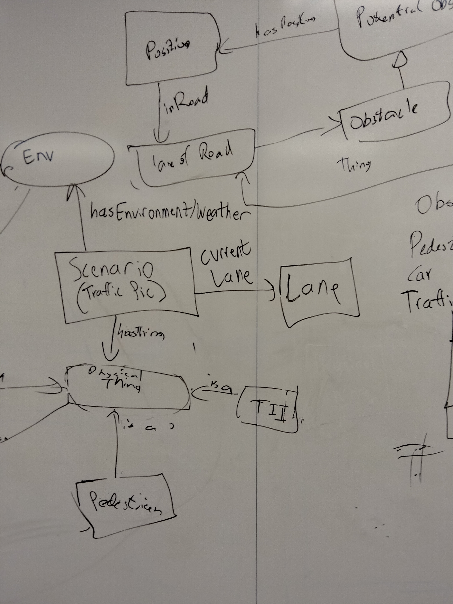
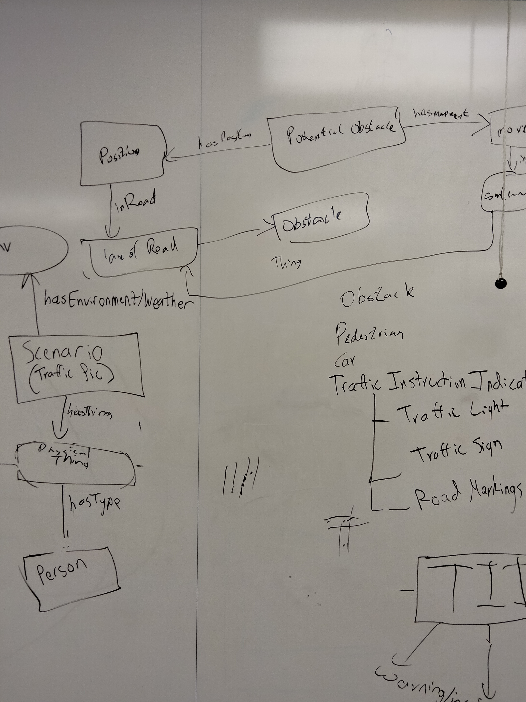
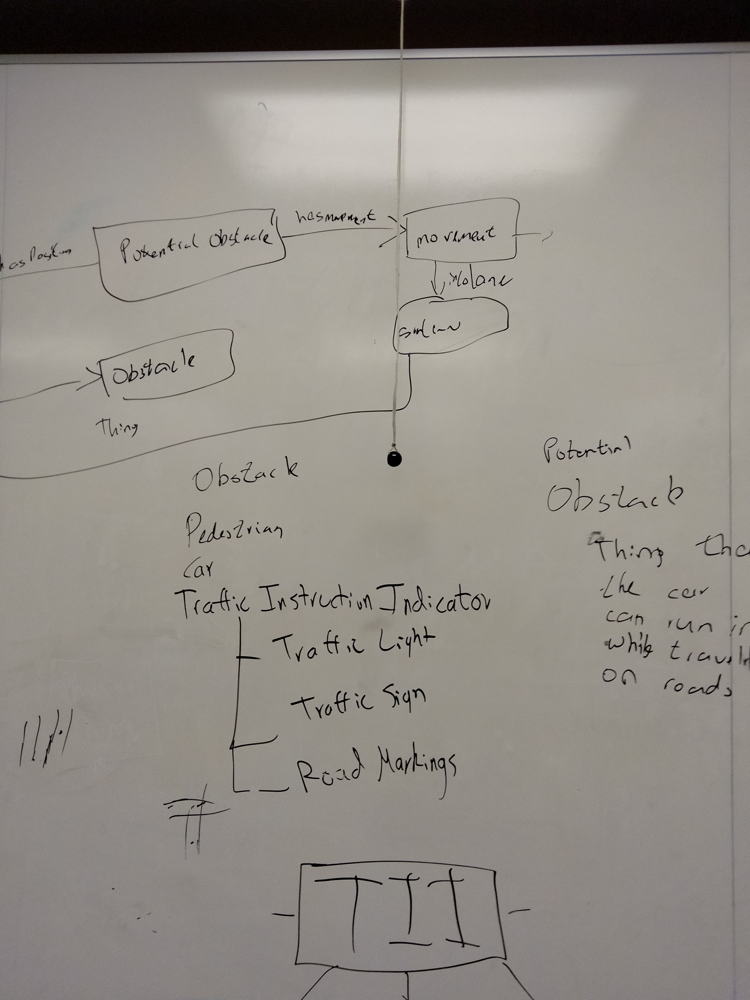
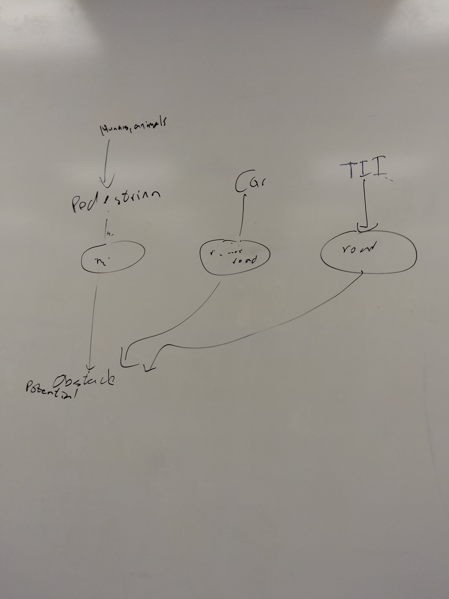

# Meeting Minutes 2/21/23
## Attendees
Chris, Alex, Jehan
## Agenda
 - Determine schema diagram
   - Create schema drafts
 - Identify key notions
## Notes / Comments

Debating schema diagram
- Obstacles:
  - Are pedestrians on the sidewalk obstacles? Potential obstacles?
  - If they are obstacles, are traffic signs obstacles as well?
  - Maybe operate under assumption that the car will only be operating on the street
- Obstacle: Physical thing that the car can run into while travelling on the street
- If multiple lanes exist, determine which obstacles are in our lane as well as obstacles belonging to other lanes
- We need to determine which lane is our lane (which lane we are driving in)

Should scenario haveType "Thing" and specify if a Thing is a "Physical Thing" or only have hasType "Physical Thing"

Debating whether traffic sign is obstacle:
- Signs on side of road are not obstacles if we are assuming we're only operating on road
- Construction signs in the middle of the road are traffic signs that would be considered obstacles

- We don't care about people inside of cars
- Animals are considered pedestrians

- Pedestrians in road are considered obstacles
- Pedestrians on the side of the road considered "Potential Obstacle"?

Traffic Instruction Indicator (TII)
- Subgroups:
  - Traffic Light
  - Traffic Sign
  - Road Markings
- Modeling Information of Indicator:
  - What type of sign?
  - Restrictive sign
  - Warning/Information sign
  - Suggestion signs
  - List of enums for each different traffic sign

Every obstacle has:
 - Position
 - Maybe not trajectory, but some movement (direction?)
 - Object has container of "Plausible Movement Directions" with one or more directions

Using lanes:
- Use lanes to model movement among objects
  - Objects moving in and out of lanes
  - Objects moving further away or closer in lanes

## Action Items
- Take photos of Schema drafts created on board
- Before Thursday:
  - Think about schema relationships and information
  - Download yEd and familiarize self with program
- On Thursday:
  - Put yEd diagrams onto Github

## Whiteboarding From Meeting

Not proper schema

 
 
  

 

