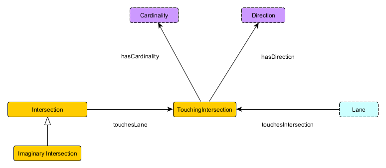

# Traffic Scenario Ontology

## Scenario

### Axioms
* `Scenario SubClassOf hasEnviornment exactly 1 Environment`  
	"A Scenario has exactly one Environment"
* `Environment SubClassOf hasTemperature at most 1 Temperature`  
	"An Environment has up one Temperature."
* `Scenario SubClassOf containsLane min 1 Lane`  
	"A Scenario contains at least one Lane."
* `PhysicalThing SubClassOf inverse hasThing exactly 1 Scenario`  
	"Every PhysicalThing is within exactly one Scenario."
* `Scenario SubClassOf hasIntersection min 1 Intersection`  
	"A Scenario has at least one Intersection"
* `Scenario SubClassOf aboutCar exactly 1 Self`  
	"A Scenario has exactly one Self corresponding to the user's vehicle"
* `Temperature SubClassOf hasValue some xsd:integer`  
	"A Temperature is represented as an integer value"

## Lane

### Axioms
* `Lane SubClassOf directLeftOf max 1 Lane`  
	"A Lane can be directly left of at most one other Lane."
* `Lane SubClassOf directRightOf max 1 Lane`   
	"A Lane can be directly right of at most one other Lane."
* `directLeftOf inverse of directRightOf`  
	"If one Lane is directly left of another Lane, the second Lane is directly right of the first Lane."
* `Lane SubClassOf visiblyEndsAt max 1 Distance`   
	"A Lane has at most one Distance away where it visibly ends."
* `Road SubClassOf inverse inRoad min 1 Lane`   
	"A Road has at least one Lane"
* `Lane SubClassOf touchesIntersection min 1 TouchingIntersection`   
	"A Lane always touches at least one Intersection."
* `Lane SubClassOf touchesIntersection max 2 TouchingIntersection`  
	"A Lane always touches at most two Intersections."
* `Lane SubClassOf inRoad exactly 1 Road`  
	"Every Lane is in exactly one Road"
* `Distance SubClassOf hasValue some xsd:float`  
	"A Distance is represented by a floating-point value."
	
### Rules
* "If a Lane touches the same Intersection of another Lane and both are in the same Road, both Lanes have the same cardinality."
* "If a Lane is directRightOf another Lane, both of those Lanes are inRoad the same Road."

## Intersection

### Axioms
* `TouchingIntersection SubClassOf hasDirection exactly 1 Direction`  
	"A TouchingIntersection has exactly one Direction"
* `TouchingIntersection SubClassOf hasCardinality exactly 1 Cardinality`  
	"A TouchingIntersection has exactly one Lane"
* `TouchingIntersection SubClassOf inverse touchesIntersection exactly 1 Lane`  
	"A TouchingIntersection has exactly one Cardinality"
* `TouchingIntersection SubClassOf inverse touchesLane exactly 1 Intersection`  
	"A TouchingIntersection has exactly one Intersection"
* `Scenario SubClassOf hasIntersection exactly one ImaginaryIntersection`  
	"A Scenario has exacty one Intersection which is an ImaginaryIntersection."
	
## Traffic Instruction Indicator

### Axioms
* `Traffic Instruction Indicator (TII) SubClassOf conveys exactly 1 Traffic Instruction`  
	"Traffic Instruction Indicator (TII) conveys a single Traffic Instruction"
* `Traffic Instruction Indicator (TII) SubClassOf hasCategory exactly 1 Restriction/Warning/Info`  
	"Traffic Instruction Indicator (TII) has exactly one category of Restriction/Warning/Info"
* `Traffic Sign DisjointWith Traffic Light`  
        "A Traffic Sign is mutually exclusive from Traffic Light"
* `Traffic Light DisjointWith Road Marking`    
        "A Traffic Light is mutually exclusive from  Road Marking"
* `Traffic Sign DisjointWith Road Marking`  
	"Traffic Light, Road Marking, and Traffic Sign are all mutually exclusive types of Traffic Instruction Indicator (TII)."

### Unneeded?
* `Traffic Instruction Indicator (TII) SubClassOf PhysicalThing`  
	"Every Traffic Instruction Indicator (TII) is a PhysicalThing (but only some TIIs are Potential Obstacles)"
* `Road Marking SubClassOf Traffic Instruction Indicator (TII)`  
* `Traffic Sign SubClassOf Traffic Instruction Indicator (TII)`  
* `Traffic Light SubClassOf Traffic Instruction Indicator (TII)`  
	"Traffic Light, Road Marking, and Traffic Sign are all types of Traffic Instruction Indicator (TII)."

## Potential Obstacle

### Axioms
* `Position SubClassOf onLane max 2 Lane`   
	"A Position is always in at most 2 Lanes."
* `RelToLane SubClassOf relation exactly 1 Left/Right/On`   
	"The Position of a Potential Obstacle is either on a Lane, or to the right or left of a Lane."
* `Position SubClass hasRelativity exactly one RelToLane`  
* `RelToLane SubClass relToLane exactly one Lane`  
	"A Position is always given relative to a single Lane."
* `Motion SubClassOf direction exactly one Left/Right`  
	"A Motion is either to the left or right" (implicitly relative to the current Road.)
* `Motion SubClassOf towardsLane min 1 Lane`  
	"A Motion is always twoards at least one Lane."  
* `Obstacle SubClassOf relToLane o relativity some On  (This manchester is almost certainly wrong)`  
	"If the Position of a Potential Obstacle is not on any Lanes, that PotentialObstacle is not an Obstacle. Otherwise, it is."

### Rules 
* "If a Position is in two Lanes, then one of those two Lanes is directRightOf the other."
* "If a Potential Obstacles' Motion is towards a Lane then that Motion is towards Lanes that are directlyrightof/leftof and between that Position and Lane."

## Car

### Axioms
* `Car SubClassOf conductingManeuver exactly one Maneuver.`  
	"A Car is always conducting exactly one Maneuver."

## General (Not Module-Specific)
* `T SubClassOf for-all hasValue only xsd:AnyValue`  
	"All stubs (using the hasValue relationship) point to an xsd primitive."

## Rules about Maneuvers (not real/in graph at this time)
* "If one Lane is an incomingLane of an Intersection, and another Lane is an outgoingLane of the same Intersection, a lane-switch Maneuver between those two Lanes is not allowed." (not really an axiom)
* "If there is a Car that is moving on an incoming Lane to an Intersection, any Maneuver which passes through that Intersection from a different Lane, which is not parallel to that Lane (has the same or opposite Cardinality), is not allowed???" (Intersecting Car Axiom)
* "If there is a Stop Sign at a Lane and Intersection, and we are not at that Intersection, the only Maneuver allowed is the stop at spot and proceed."
* "If there is a Stop Light at a Lane and Intersection, any Maneuver that is not the stop maneuver from that Lane is not allowed."
* "If there is a Speed Limit sign (in a Lane/Scenario?) the FormalSpeedLimit is equal to that sign's numerical value."
* "If there is a Priority Lane sign at an Intersection, the Intersecting Car Axiom does not apply if we are in the Lane containing the sign or Parallel to that Lane."(Gonna Keep it till later)
* "If a Lane contains a Turn Lane Marking, then Turn maneuvers from Parallel Lanes that do not contain Turn Lane Markings are not allowed." (?)
  * Also need to express that turn may be allowed only in one direction at that point
* "If a Lane contains a Left/Right Turn Only Lane Marking, then move Forwards maneuvers from that Lane are not allowed."
