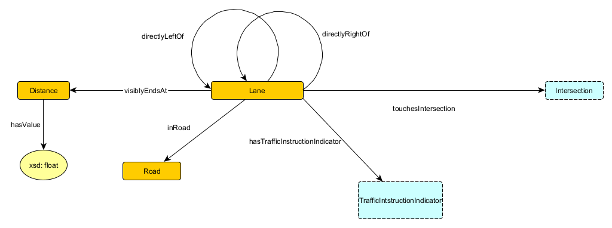

# Traffic Scenario Ontology

## Scenarios

### Axioms
* "A scenario has exactly one Environment"
* "An environment has (up to?) one hasTemperature."
* "A scenario has exactly one currentLane (if currentLane stays a thing)"
* "Every physical thing is pointed to by exactly one Scenario via hasThing."
* "A Scenario has atleast one intersection"
* "A Scenario has exactly one Self"

## Lanes

### Axioms
* "A Lane can be directLeftOf at most one other Lane."
* "A Lane can be directRightOf at most one other Lane."
* "If one Lane is directLeftOf another Lane, that lane is directRightOf the first Lane."
* "If a Lane is directRightOf another Lane, both of those Lanes are inRoad the same Road."
* "A Lane has at most one visiblyEndsAt relationship with a Distance."
* "A Road has atleast one lane"
* "A lane always touches one or two TouchingIntersections."

### Rules
* "All lanes that touch the same interesection and are inRoad of same road have the same cardinality"

## Intersections

### Axioms
* "For every lane that touchesIntersection an Intersection, that Intersection points to that lane with one of either ingoingLane or outgoingLane." 
* "A touchingIntersection has exactly one direction"
* "A touchingIntersection has exactly one lane"
* "A touchingIntersection has exactly one cardinality"
* "A touchingIntersection has exactly one intersection"

## Traffic Instruction Indicators

### Axioms
* "Every Traffic Instruction Indicator is a PhysicalThing (but only some TIIs are Potential Obstacles)"
* Every TII is exactly one of a Traffic Light, a Traffic Sign, or a Road Marking."
* "TII can be restrictive" 

## Potential Obstacles

### Axioms
* "A Position is always in at most 2 lanes."
* "The position of a potentialObstacle relative to lane"
* "The position of a potentialObstacle can be exactly one onLane, rightOfLane, leftOfLane"
* "If the Position of a PotentialObstacle is not onLane any Lanes, that PotentialObstacle is not an Obstacle. Otherwise, it is."
* "Motion has exactly one left/right relationship" (implicitly relative to the current road.)
* "Motion has atleast one towardsLane"  

### Rules 
* "If a Position is in two Lanes, then one of those two lanes is directRightOf the other."
* "If a potential obstacles' motion is towards a lane then that motion is towards lanes that are directlyrightof/leftof and between that position and lane."

## Cars

### Axioms
* "A Car is always conductingManeuever exactly one manuever."

## Rules about Maneuevers (not real)
* "If one Lane is an ingoingLane of an intersection, and another lane is an outgoingLane of the same intersection, a lane switch maneuver between those two lanes is not allowed." (not really an axiom)
* "If there is a Car that is Moving on an Incoming Lane to an Intersection, any manuever which passes through that intersection from a different Lane, which is not Parallel to that Lane (has the same or opposite Cardinality), is not allowed???" (Intersecting Car Axiom)