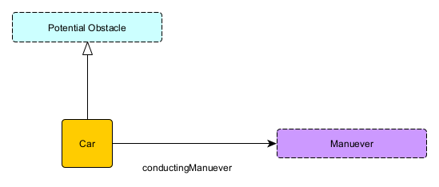

# Name of the Knowledge Graph
**Authors:** Jehan Fernando, Chris Menart, Alex Moore

## Use Case Scenario
### Narrative 
Adapted from `use-case.md`.

### Competency Questions
Adapted from `use-case.md`.

### Integrated Datasets
Adapted from `use-case.md`.

### References
Adapted from `use-case.md`.

## Modules
<!-- There should be one module section per module (essentially per key-notion) -->
### Car
**Source Pattern:** name of adapted source pattern
**Source Data:** name(s) of dataset(s) which populate this module

#### Description
Cars are of obvious interest to a system concerned with traffic and roads. One of the most obvious pieces of information to track about cars would be make, model, or other forms of classification. But after debate, we chose not to include these details, resulting in the lightest schema in the ontology. What we care about with respect to vehicles is rather where they are (which is covered by the PotentialObstacle schema) and where they are going.

One of the core imagined functions of our KG is reasoning over what meanuevers are possible for a self-driving vehicle to perform, and which ones it is actually allowed to do. Here, these will be represented by a controlled vocabulary, which we can iterate over and "check" against the existence of things which might make them disallowed. This same controlled vocabulary can be used to track the actions currently being executed by our neighbors.

Theoretically, these could use the Events pattern from MODL, but using ParticipantRoles or SpatioTemporalExtents would significantly increase the complexity of our ontolgoy and does not seem to fit directly into our use cases.

### Intersection
**Source Pattern:** name of adapted source pattern
**Source Data:** name(s) of dataset(s) which populate this module

#### Description
Intersection was the latest addition to the ontology. At first, it was a property by which Lanes pointed to each other, a way of determining which locations in a Scenario could be reached from one another. However, we quickly realized that Intersection needed to be reified so that more details about an intersection could be tracked--to begin with, the intersection of an arbitrary number of lanes of traffic at once. 

An Intersection is a collection of lanes which tracks the direction of its attendant lanes--which are incoming or outgoing--and also their cardinality, i.e. what order the roads at an intersection can be found by counting clockwise or counterclockwise around it. We closely considered both the bag and ordered list patterns from MODL to represent this strucutre, but neither felt perfectly appropriate. There are several intricacies specific to traffic intersection, such as the additional pieces of information noted above. Lanes can also touch more than one intersection (in fact, up to two).

### Lane
**Source Pattern:** name of adapted source pattern
**Source Data:** name(s) of dataset(s) which populate this module

#### Description
This key notion encompases any surface that a vehicle/car can drive on. All lanes have a direction relative to an intersection, if an intersection is not within visual range an assumption is made that the lane is coming from an intersection. Lanes can have other lanes to the right and left. We are using "directlyLeftOf" and "directlyRightOf" to represent lanes that are adjacent to the lane without nothing in between. A manuever of switch lanes can be conducted if the lanes are directlyRightOF or directlyLeftOf and both lanes are in the same direction relative to the same intersection.

### Potential Obstacle
**Source Pattern:** name of adapted source pattern
**Source Data:** name(s) of dataset(s) which populate this module

#### Description
Obstacles (or Potential Obstacles) represent things on the road that could block our driving (or things which could potentially end up on the road and do so). Theoretically an AgentRole could be used to represent Obstalces, but it was decided this represented unnecessary overhead. All we really need to know about an obstacle is its position (and possibly movement) in space--which lanes it is obstructing and which it might obstruct. We don't care about it at all outside of this, so the Obstacle class is used directly to represent any objects which can be obstacles, as seen in "PotentialObstacle.png".

### Scenario
**Source Pattern:** name of adapted source pattern
**Source Data:** name(s) of dataset(s) which populate this module

#### Description
The scenario is the key notion that combines all the other key notions using a given traffic image. Using the traffic image, we may determine the lanes and intersections, as well as all potential obstacles and traffic instruction indicators that may affect our queries regarding potential available maneuevers. Additionally, each traffic image will reveal environmental information that may be necessary such as weather conditions, outside temperature, and time of day.

### Traffic Instruction Indicator
**Source Pattern:** name of adapted source pattern
**Source Data:** name(s) of dataset(s) which populate this module

#### Description
This key notion encompasses any physical object on or near the road that provides information to drivers, such as road or traffic signs, road markings, and traffic lights. (We exclude lane lines from this definition). Each Traffic Instruction Indicator conveys a traffic instruction, represented using a controlled vocabulary, applied to a given lane or lanes. These instructions will provide information and/or restrictions to the possible maneuvers for the vehicle.

#### Axioms
* `axiom in manchester syntax`  
natural language description
* `axiom in manchester syntax`  
natural language description

#### Remarks
* Any remarks re: usage

## The Overall Knowledge Graph
### Namespaces
* prefix: namespace
* prefix: namespace

### Schema Diagram

### Axioms
* `axiom in manchester syntax`  
natural language description
* `axiom in manchester syntax`  
natural language description

### Usage
Adapted from `validation.md`, i.e., the competency questions + SPARQL queries.

