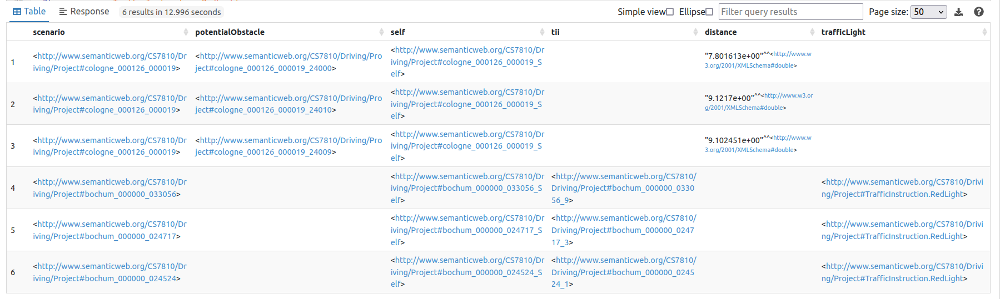
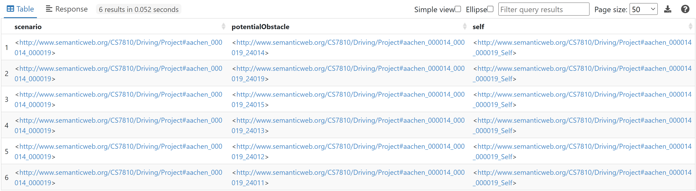
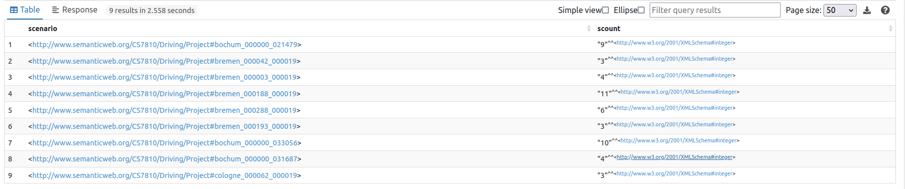
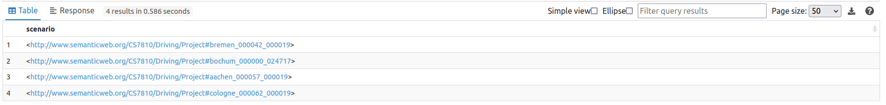
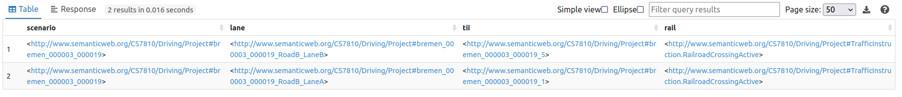
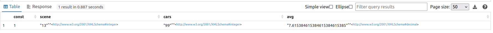
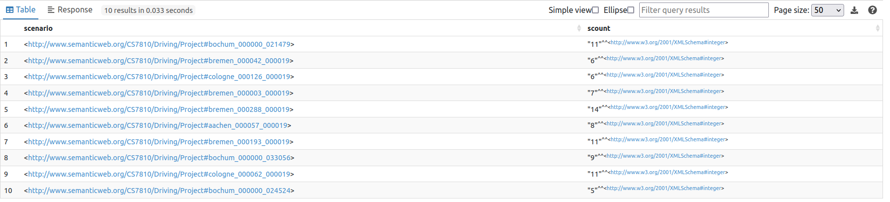
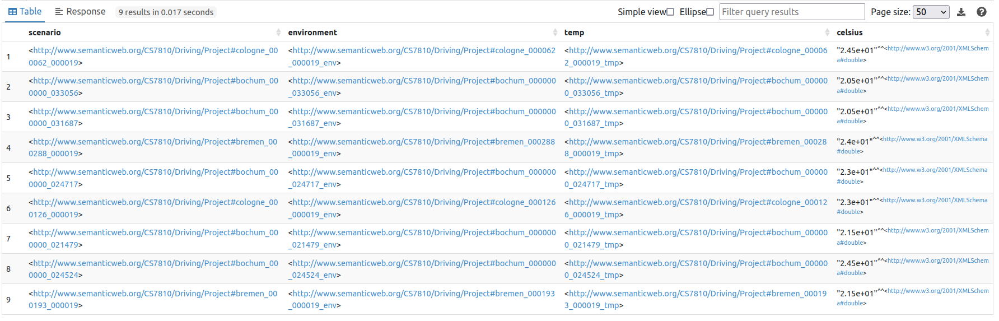
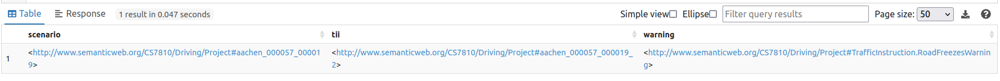
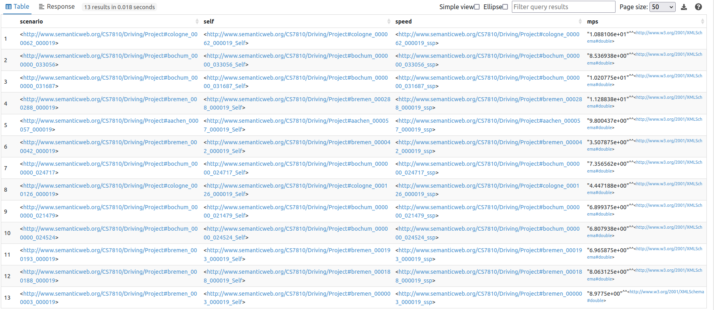

# Validation

## Stopping or Slowing Question
**Competency Question:** "In which scenarios does the car need to stop or slow down?"

**Bridged Datasets:** dataset 1, dataset 2, ...

**SPARQL Query:**
```
SELECT DISTINCT ?scenario ?potentialObstacle ?self ?tii ?distance ?trafficLight
WHERE {
  {
  ?scenario a :Scenario .
  ?scenario :hasThing ?potentialObstacle .
  ?potentialObstacle :hasPosition ?position . 
  ?position :hasRelativity ?rel .
  ?rel :relativity :On-Left-Right.On .
  ?rel :relToLane ?lane .
  ?scenario :aboutCar ?self .
  ?self :hasPosition ?position1 . 
  ?position1 :hasRelativity ?rel1 .
  ?rel1 :relToLane ?lane .
  ?potentialObstacle :distanceDownLane ?distance .
  FILTER(?distance < 10) .
  }
  UNION
  {
  ?scenario a :Scenario .
  ?scenario :aboutCar ?self .
  ?self :hasPosition ?position1 . 
  ?position1 :hasRelativity ?rel1 .
  ?rel1 :relToLane ?lane .
  ?lane :hasTrafficInstructionIndicator ?tii .
  ?tii :conveys :TrafficInstruction.RedLight .
  ?tii :conveys ?trafficLight .
  }
} 
```

**Results:**
<br>
 
<br><br><br><br>
## Potential Obstacle Question
**Competency Question:** "In which scenarios is there an object moving into the lane?"

**Bridged Datasets:** Cityscapes and associated manual markup

**SPARQL Query:**
```

SELECT DISTINCT ?scenario ?potentialObstacle ?self 
WHERE {
  {
  ?scenario a :Scenario .
  ?scenario :hasThing ?potentialObstacle .
  ?potentialObstacle a :PotentialObstacle .
  ?potentialObstacle :hasMotion ?motion . 
  ?motion :towardsLane ?lane .
  ?scenario :aboutCar ?self .
  ?self :hasPosition ?position1 . 
  ?position1 :hasRelativity ?rel1 .
  ?rel1 :relToLane ?lane .
  }
}
```

**Results:**
<br>
 
<br><br><br><br>

## Number of Lanes Question
**Competency Question:** "Which scenarios have more than two lanes in the current road?"

**Bridged Datasets:** Cityscapes and associated manual markup

**SPARQL Query:**
```
SELECT DISTINCT ?scenario (COUNT(?scenario) as ?scount) where { 
  ?scenario :containsLane ?lane1.
} GROUP BY ?scenario
HAVING (?scount>2)
```

**Results:**
<br>
 
<br><br><br><br>

## Lane Direction Question
**Competency Question:** "In which scenarios is the current road a one-way street?"

**Bridged Datasets:** Cityscapes and associated manual markup

**SPARQL Query:**
```
SELECT DISTINCT ?scenario  where { 
   ?scenario a :Scenario .
   FILTER NOT EXISTS {
   ?scenario :containsLane ?lane .
      ?lane :touchesIntersection ?touchingIntersection .
      ?touchingIntersection :hasDirection :Direction.Incoming .
    }
} GROUP BY ?scenario
```

**Results:**
<br>
 
<br><br><br><br>


## Railroad-Crossing Question
**Competency Question:** "In which scenarios is there a railroad-crossing currently closed for train access?"

**Bridged Datasets:** Cityscapes and associated manual markup

**SPARQL Query:**
```
SELECT  DISTINCT ?scenario ?lane ?tii ?rail
WHERE {
  ?scenario a :Scenario .
  ?scenario :containsLane ?lane .
  ?lane a :Lane .
  ?lane :hasTrafficInstructionIndicator ?tii .
  ?tii :conveys :TrafficInstruction.RailroadCrossingActive .
  ?tii :conveys ?rail .
}
```

**Results:**
<br>
 
<br><br><br><br>

## Average Number of Cars Question
**Competency Question:** "What is the average number of cars in a scenario?"

**Bridged Datasets:** Cityscapes and associated manual markup

**SPARQL Query:**
```
SELECT  ?const (COUNT(distinct ?scenario) as ?scene) (COUNT(distinct ?numCars) as ?cars)  (?cars/?scene as ?avg) where { 
    VALUES ?const {"1"}
    ?scenario a :Scenario .
    ?numCars a :Car .
   	?scenario :hasThing ?numCars . 
}GROUP BY ?const
```

**Results:**
<br>
 
<br><br><br><br>

## Number of Cars Question
**Competency Question:** "Which scenarios contain more than 4 cars?"

**Bridged Datasets:** Cityscapes and associated manual markup

**SPARQL Query:**
```
SELECT DISTINCT ?scenario (COUNT(?car) as ?scount) where { 
  ?scenario a :Scenario .
  ?scenario :hasThing ?car.
  ?car a :Car .
} GROUP BY ?scenario
HAVING (?scount>4)
```

**Results:**
<br>
 
<br><br><br><br>

## Merging Question
**Competency Question:** "In which scenarios can the car merge to the right and/or left?"

**Bridged Datasets:** Cityscapes and associated manual markup

**SPARQL Query:**
```
SELECT DISTINCT ?scenario ?lane ?lane1
WHERE {
  {
  ?scenario a :Scenario .
  ?scenario :aboutCar ?self .
  ?scenario :containsLane ?lane .
  ?self a :Self .
  ?self :hasPosition ?position . 
  ?position :hasRelativity ?rel .
  ?rel :relToLane ?lane .
  ?lane a :Lane .
  ?lane :directlyLeftOf ?lane1 .
  ?lane :touchesIntersection ?touchInter .
  ?lane1 :touchesIntersection ?touchInter1 .
  ?intersection a :Intersection .
  ?intersection :touchesLane ?touchInter .
  ?intersection :touchesLane ?touchInter1 .
  ?touchInter :hasDirection ?dir .
  ?touchInter1 :hasDirection ?dir1 .
    FILTER(?dir = ?dir1)
     FILTER NOT EXISTS{
      ?scenario :hasThing ?thing .
      ?thing :hasPosition ?position1 . 
      ?position1 :hasRelativity ?rel1 .
      ?rel1 :relToLane ?lane1 .
      ?rel1 :relativity :On-Left-Right.On .
    }
  }
  UNION
  {
      ?scenario a :Scenario .
  ?scenario :aboutCar ?self .
  ?scenario :containsLane ?lane .
  ?self a :Self .
  ?self :hasPosition ?position . 
  ?position :hasRelativity ?rel .
  ?rel :relToLane ?lane .
  ?lane a :Lane .
  ?lane :directlyRightOf ?lane1 .
  ?lane :touchesIntersection ?touchInter .
  ?lane1 :touchesIntersection ?touchInter1 .
  ?intersection a :Intersection .
  ?intersection :touchesLane ?touchInter .
  ?intersection :touchesLane ?touchInter1 .
  ?touchInter :hasDirection ?dir .
  ?touchInter1 :hasDirection ?dir1 .
  FILTER(?dir = ?dir1)
     FILTER NOT EXISTS{
      ?scenario :hasThing ?thing .
      ?thing :hasPosition ?position1 . 
      ?position1 :hasRelativity ?rel1 .
      ?rel1 :relToLane ?lane1 .
      ?rel1 :relativity :On-Left-Right.On .
    }
  }
}
```

**Results:**
<br>
 
<br><br><br><br>

## Temperature Question
**Competency Question:** "Which scenarios have temperatures above 20 degrees Celsius?"

**Bridged Datasets:** Cityscapes and associated manual markup

**SPARQL Query:**
```
SELECT ?scenario ?environment ?temp ?celsius
WHERE { 
    ?scenario a :Scenario .
    ?scenario :hasEnvironment ?environment .
    ?environment :hasTemperature ?temp .
    ?temp :hasValue ?celsius .
    FILTER(?celsius > 20)
}
```

**Results:**
<br>
 
<br><br><br><br>

## Temperature Restriction Question
**Competency Question:** "Which scenarios include restrictions based on the temperature?"

**Bridged Datasets:** Cityscapes and associated manual markup

**SPARQL Query:**
```
SELECT ?scenario ?tii ?warning
WHERE { 
    ?scenario a :Scenario .
    ?scenario :hasThing ?tii .
    ?tii :conveys :TrafficInstruction.RoadFreezesWarning .
    ?tii :conveys ?warning .
}
```

**Results:**
<br>
 
<br><br><br><br>

## Current Speed Question
**Competency Question:** "What is the current speed of the car?"

**Bridged Datasets:** Cityscapes and associated manual markup

**SPARQL Query:**
```
SELECT ?scenario ?self ?speed ?mps
WHERE { 
    ?scenario a :Scenario .
    ?scenario :aboutCar ?self .
    ?self :hasSpeed ?speed .
    ?speed :hasValue ?mps .
}
```

**Results:**
<br>
 
<br><br><br><br>
