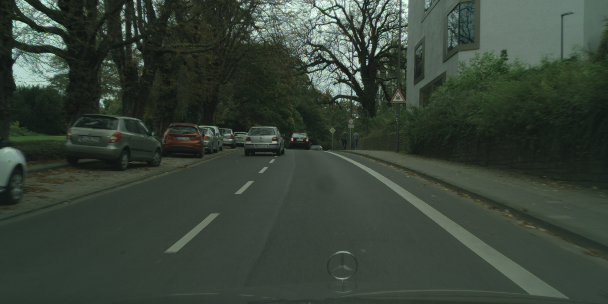
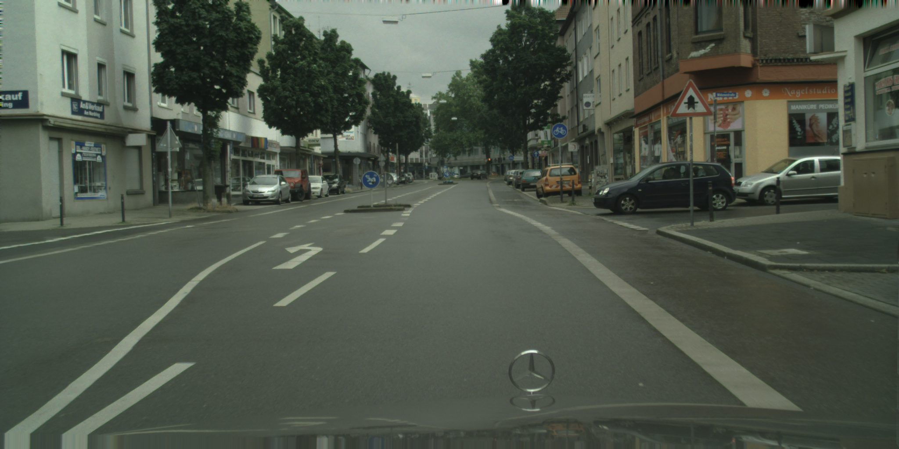
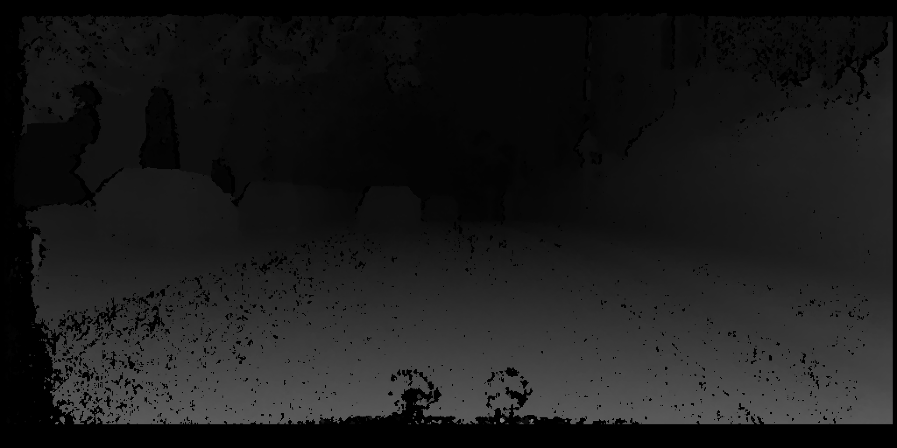

# Narrative
Self-driving cars often utilize machine learning techniques to identify the presence of cars, road signs, drivable lanes, and other relevant objects and obstacles. However, this identification is not the same as knowing what driving actions are allowable. The vehicle must perform additional processing to understand what maneuvers, such as forward movement, lane switching, and turning, are safe and legal. This could potentially be done with reinforcement learning, but this may be opaque, brittle, and resistant to the inclusion or easy changing of policies and business rules. A semantic technology such as a knowledge graph, alternatively, could reason over the vehicle's knowledge about its surroundings to determine appropriate actions.
  
The knowledge graph intends to provide information to cars and car-users to act upon data produced from the sensors to compute possible interactions. This knowledge graph will be populated with knowledge obtained from the analysis of optical and/or lidar data. These interactions will be further filtered based on the needs of the user. For example, a car approaching an intersection has the possibilities of going dtraight, turning right or left, coming to a stop but might not have the  option of making a U-turn. If the car-user needs to go left, the car must be in appropriate lane (curb lane unless marked otherwise).

 

  
  
 
 
 
 
 
 
 
 
 
   
   
   
---

_Above are shown example scenes are system might reason over. Traffic signs are a useful source of information about what actions are allowable on the road! Left: If a sign indicates that we are on a bridge which freezes over easily, we may wish to slow down depending on our knowledge of the current temperature orseason. Right: If a sign indicates that we have the right of way, we know that we do not have to stop for vehicles proceeding down an intersecting road._ 

---

In addition to traffic signs, our calculations can involve three-dimensional spatial reasoning. The ego-distance of cars and other obstacles affects our available actions, as does whether objects are in front of or behind each other, or on drivable surfaces such as they road. 

 

---

_Three-dimensional locations can be computed from the data in the machine-learning databases from which we are mining our example situations. The "disparity image" here encodes depth information computed from binocular cameras. (This depth map encodes distances for the bridge image directly above.)_

---

 
 
 
 

We are considering the incorporation of information about types and number of lanes in our knowledge graph, in order answer queries such as "Can I pass this stopped car by switching lanes?" Only one of the databases we are looking at includes this information.

# Competency Questions
* Does the car need to stop or slow down?
* Will an object move into the road?
* What will happen if the vehicle crashes into object X?
* Can the vehicle legally perform requested maneuver?
* Is this street a one-way street?
* Can this vehicle fit the size/height/weight restrictions of the road/parking spot?
* Which object should the vehicle prefer to hit if unavoidable?
* Is there a current restriction to speed (school zone, etc)?
* Is this railroad currently closed for train access?
* What is the average number of cars traveling on the road per time period?
* Which side of the road does the car need to drive?

# Potential Datasets
* Self-Driving Sensor Data
  * [Cityscapes https://www.cityscapes-dataset.com/]
  * [BDD100K https://www.bdd100k.com/]
  * [The KITTI Vision Benchmark Suite https://www.cvlibs.net/datasets/kitti/]
* Common Sense Data
  * [Wordnet https://wordnet.princeton.edu/]
* Driving Laws Data
  * [FindLaw (this is prose though) https://www.findlaw.com/traffic/traffic-tickets/state-traffic-laws.html]
* Traffic Signage Data
  * [Kaggle https://www.kaggle.com/datasets/andrewmvd/road-sign-detection]
  * [Manual of Traffic Signs http://www.trafficsign.us/index.html]
* Road Safety Data  
  * [Road Safety Database [https://github.com/todrobbins/dtcdb](https://www.data.gov.uk/dataset/cb7ae6f0-4be6-4935-9277-47e5ce24a11f/road-safety-data)] 

# Removed for Scope Reasons
## Competency Questions
* Is this a toll road?
* Does the vehicle have enough gas/charge to make it to the next gas/charge station?
* Road closures/additional traffic due to functions such as parades/protests etc...?
* Is the car experiencing any issues?
* What is the possible issue depending on the symptoms?
* Does the car need to pull off the road?
* What are the consequences if action is not taken to take car of the issue?

## Datasets
* Diagnostic and Maintenance Data  
  * [Diagnostic and Trouble Code Database https://github.com/todrobbins/dtcdb] 
* Navigation/Trip Planning Data
  * [Alternative Fuels Data Center https://afdc.energy.gov/fuels/electricity_locations.html#/find/nearest?fuel=ELEC]
  * [TollGuru (has an API, should be scrapable) https://tollguru.com/toll-calculator]
  * Google Maps can be scraped
